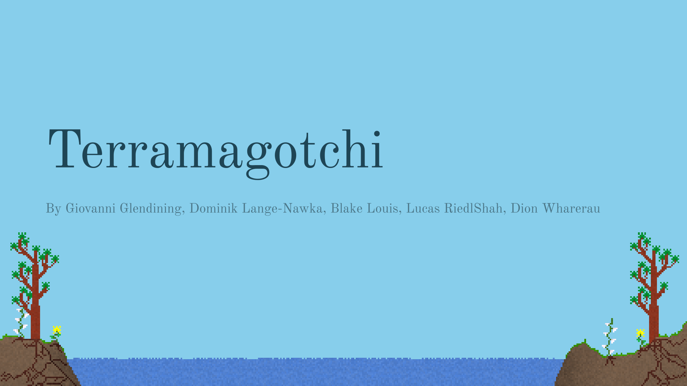

<route lang="yaml">
meta:
  title: Terramagotchi
  year: 2022
  tags: [generative art]
  coverImage: /src/assets/terramagotchi/1.svg
</route>

<!-- <iframe
  frameborder="0"
  src="https://terramagotchi.web.app/"
  title="Terramagotchi App"
  height="540"
  width="960"
  class="full-width"
  style="
    justify-self: center;
    margin: 20px;
    width: 100%;
    height: 90vh;
    color-scheme: initial;
  "
>
  <a href="https://terramagotchi.web.app/">terramagotchi.web.app</a>
</iframe> -->

<a href="https://github.com/generatively/terramagotchi">GitHub Repo</a>

:::full-width

:::

## Introduction

### What is the problem we are trying to solve? Why is it important?

The goal of this application was to create a realistic and interactive art piece which educates people by simulating the nature cycles and the processes that underlie them.  
The application presents environmental concepts in a fun, interesting way, which viewers can engage with together.

## Motivation

### Novelty of our solution, and how it is different from existing projects.

Our application is inspired by the classic [falling-sand game](https://en.wikipedia.org/wiki/Falling-sand_game), which many have built upon, most notably, [Sandspiel](https://sandspiel.club/). What makes our application unique, is the user interaction approach. People cannot draw into the environment directly, but instead interact with it via a “remote”. This allows many people to interact with the same environment at once.

## Environment

### Terrain Generation

The environment is generated using several layers of Simplex noise at different scales. This creates a relatively realistic terrain slice which is different each time the application is loaded but is still visually appealing.

A key feature which we desired was to have a river running through the middle of the terrain. To achieve this, a sine wave is used to dip into the terrain. This space is then filled in with water. The noise is applied atop the sign wave, meaning that the terrain in the river still retains some of the bumps in the terrain.

To add more visual interest to the bottom half of the environment, a mixture of a linear gradient and some banding gives the effect of the soil darkening the deeper it goes.

### The Water Cycle

 - Day-Night Cycle  
 - Water Cycle  
   - Evaporation (Steam from water)
   - Transpiration (Steam from plants)
   - Condensation (Rain)  
 - Randomized Clouds - 2D Simplex Noise

As time passes, the environment will cycle through day and night. This is simply achieved via an overlayed block of colour, which darkens the sky, and the soil equally.

## Absorption & Roots

Key aspect to the cycle is absorption  
Soil absorbs from bodies of water and compost, and distributes water and nutrients amongst itself  
Roots absorb water and nutrients from soil and transfers them to plants  
All done on a particle level  
Roots are grown randomly and are dependent on few variables that can be changed easily  
Allows for diversity  

## Plants

### Plant Design Specifications

The role of plants in Terramagotchi  
Complete Life Cycle of a Plant  
Plant Growth  
What about the leaves?  
Plant death  

### Implementation

Simulating Genetic Code & DNA

Nearest-Neighbour Limitations  
Growth Mechanics  
Vectors and Curve Fitting  

## Worms

Organisms are responsible for consuming dead plants and producing compost.

### Movement

### Dead Plant Consumption

### Compost Production

### Wandering

### Death

## Remote Application & User Interaction

### User Interaction

### Remote App

#### Why?

#### Design

#### Features

